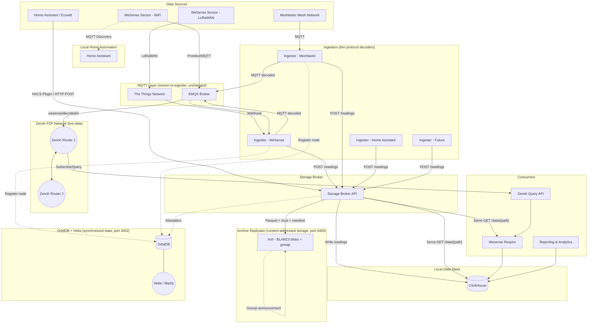

# Data Flow

## Architecture Overview

The full architecture adds Zenoh for live P2P distribution, OrbitDB for synchronized state, and Iroh for historical archive replication. The `wesense-live-transport` is the single integration point between MQTT and Zenoh — it subscribes to decoded MQTT topics and publishes to the Zenoh P2P network, and vice versa. See P2P_Preparation.md for full decision rationale and Phase2Plan.md Section 14 for the distributed archive design.



**Key differences from previous architecture:**

| Aspect                     | Previous (v3.1)                          | Current (v5.0)                                                                                                    |
| -------------------------- | ---------------------------------------- | ----------------------------------------------------------------------------------------------------------------- |
| **Live P2P transport**     | libp2p GossipSub                         | Eclipse Zenoh (pub/sub + queryables)                                                                              |
| **Wildcard subscriptions** | Not supported (workarounds needed)       | Native (`*` and `**` key expressions)                                                                             |
| **Distributed queries**    | Not available                            | Zenoh Queryables (choropleth, catchup, device lists)                                                              |
| **Message signing**        | Not specified                            | Ed25519 per-ingester signing (SignedReading protobuf)                                                             |
| **Wire format**            | JSON on P2P                              | Protobuf end-to-end                                                                                               |
| **P2P language**           | Sidecar service (js-libp2p or go-libp2p) | Native Python integration (Zenoh binding in ingester-core)                                                        |
| **NAT traversal**          | Complex (AutoNAT, hole-punching, relays) | Simple (client mode default + opt-in mesh mode)                                                                   |
| **Discovery database**     | OrbitDB (questioned)                     | OrbitDB (confirmed, on private Helia/libp2p network — not public IPFS)                                            |
| **Signature persistence**  | Not specified                            | Ed25519 signatures stored in ClickHouse for archive integrity                                                     |
| **Archive integrity**      | Not specified                            | Self-contained archives (Parquet + trust snapshot + manifest), Ed25519 signed readings, BLAKE3 content-addressing |
| **ClickHouse-to-P2P**      | Undefined bridge service                 | Ingester dual-publishes (no bridge needed)                                                                        |
| **Archive storage**        | Direct Kubo MFS API calls                | Storage broker with archive replicator (BLAKE3 content-addressed blobs + gossip)                                  |
| **Archive partitioning**   | Country-level (`/{country}/{year}/...`)  | Subdivision-level (`/{country}/{subdivision}/{year}/...`) for community-driven replication                        |
| **Ingester architecture**  | Ingesters embed ClickHouse writer        | Ingesters become thin protocol decoders, `POST /readings` to storage broker                                       |
| **Network entry**          | libp2p bootstrap nodes                   | 4-layer fallback (routers → peers → OrbitDB/libp2p → LAN)                                                         |

## Meshtastic Integration Options

Meshtastic users have two options for connecting to WeSense:

### Meshtastic Public Gateway (`MESHTASTIC_MODE=public`)

Community-operated gateways that forward all mesh network traffic to the WeSense hub. These are convenient but:

- **Availability risk** - Public gateways may go offline without notice
- **Coverage gaps** - May not exist in your area
- **Shared resource** - Subject to rate limits and congestion

**Warning: Public gateway forwarding is disabled by default.** Before enabling, you must check the OrbitDB registry to ensure another user isn't already forwarding data from that gateway. Duplicate forwarding:

- Wastes bandwidth and storage
- Overloads the public gateway operator
- Creates duplicate readings that must be deduplicated

To check, query OrbitDB for active forwarders in your region. Only enable public gateway forwarding if no one else is covering that gateway.

### Meshtastic Local Node (`MESHTASTIC_MODE=community`)

Your own Meshtastic device configured to forward telemetry to the WeSense hub via WiFi/MQTT. Benefits:

- **Reliability** - You control uptime and availability
- **Privacy** - Your data path doesn't depend on third parties
- **Contribution** - You become part of the mesh network infrastructure

**We encourage Meshtastic users to set up their own local nodes** rather than relying solely on public gateways. This improves network resilience and ensures your environmental data reaches WeSense even if public gateways become unavailable.

A local node can be as simple as a Meshtastic device with WiFi connectivity and MQTT configured to publish to the WeSense hub.

## Step-by-Step Flow

### Step 1: Sensor Publishes Reading

```
Sensor (ESP32 or LoRaWAN) publishes to MQTT:
  Topic: wesense/v2/nz/auk/office_301274c0e8fc
  Payload: <binary protobuf - SensorReadingV2 with all measurements>
```

### Step 2: Decoder Converts to JSON

```
Protobuf Decoder receives message:
  → Decodes binary protobuf
  → Publishes JSON to: wesense/decoded/nz/auk/office_301274c0e8fc
```

### Step 3: Ingester Signs and Distributes

```
Ingester receives decoded reading:
  → Signs with Ed25519 (signature of JSON payload)
  → POST signed reading to storage broker (POST /readings)
    Storage broker handles: ClickHouse write, dedup, geocoding (if needed)
  → Publishes to Zenoh as SignedReading protobuf envelope:
    Key expression: wesense/v2/live/nz/auk/office_301274c0e8fc
    Payload:
      - payload: serialized sensor reading (JSON bytes)
      - signature: Ed25519 signature of payload
      - ingester_id: "wsi_a1b2c3d4"
      - key_version: 1
  → Registers as Queryable for wesense/v2/live/nz/** (serves queries)
  → If storage broker unavailable, reading is still on Zenoh and MQTT
```

### Step 4: Consumer Subscribes and Receives

```
Wesense Respiro (via Zenoh Query API):
  1. Subscribes to: wesense/v2/live/nz/**
  2. Receives SignedReading messages as they arrive
  3. Verifies Ed25519 signature against trust list (from OrbitDB)
  4. Deserializes protobuf payload
  5. Inserts into local ClickHouse
  6. For choropleth: queries Queryables for regional aggregates
  7. UI queries local DB for display
```

### Step 5: Archival (Guardian Persona)

```
Periodically (default every 4 hours), the storage broker:
  1. Queries ClickHouse for signed readings in the archive window
     (WHERE signature != '' — only archive verified data)
  2. Re-verifies every Ed25519 signature against the trust list
  3. Exports to Parquet with signature, ingester_id, key_version columns
  4. Builds trust snapshot (public keys for all ingester_ids in this batch)
  5. Computes deterministic readings_hash (sorted reading IDs → SHA-256)
  6. Signs manifest with archiver's own Ed25519 key
  7. Writes archive files to archive replicator (BLAKE3 content-addressed blobs):
       /nz/wgn/2026/02/13/
         readings.parquet              ← signed readings
         trust_snapshot.json           ← public keys for verification
         manifest.json                 ← content hash + archiver signature
  8. Archive replicator announces new archive via gossip protocol
  9. Submits attestation to wesense.attestations OrbitDB database
  10. Attestation propagates to all participants via CRDT sync

The storage broker serves archives over HTTP:
  - GET /data/{country}/{subdiv}/{date}/... for Parquet retrieval
  - ClickHouse queries archives natively via url() function
  - Archive replicator handles content-addressed storage and P2P replication

Multiple independent archivers (guardian persona) can archive the same data:
  - Same readings → same readings_hash (deterministic, from content-based IDs)
  - Same readings_hash from 3+ archivers = strong consensus
  - No coordination protocol needed — consensus from content-addressing
```
