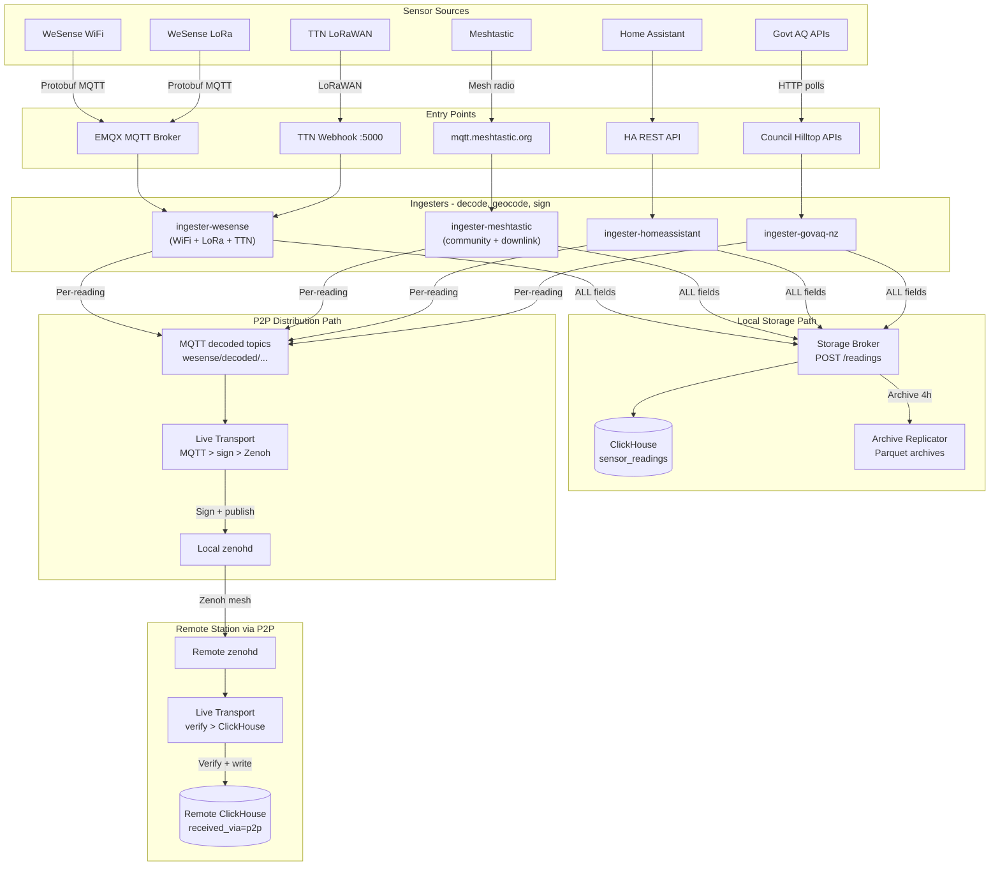

# Ingester Architecture

The WeSense architecture uses **specialized ingesters** — each data source type has its own ingester optimized for its specific requirements. Every ingester is split into two layers:

1. **Shared core library** (`wesense-ingester-core`) — All the common plumbing that every ingester needs.
2. **Thin adapter** — Source-specific decoding only. Each adapter imports the core and adds its own decoder.

The boundary is clear: **the adapter decodes raw input into a standard reading dict, then hands it to the core for everything else.**

```
raw bytes/JSON/protobuf  →  [ADAPTER: source-specific decoder]  →  standard reading dict
                                                                          │
                              [CORE: shared library takes over]           ▼
                    generate reading_id → geocode → dedup → sign (Ed25519)
                                                                → POST /readings to storage broker
                                                                → MQTT publish (for P2P distribution)
```

## Shared Core Library (`wesense-ingester-core`)

The core library consolidates all shared ingester plumbing:

```
wesense-ingester-core/
├── wesense_ingester/
│   ├── __init__.py
│   │
│   ├── pipeline.py             # ReadingPipeline — the single entry point
│   │                           #   every adapter uses. Handles:
│   │                           #   - Dedup check
│   │                           #   - Geocoding (if adapter didn't already)
│   │                           #   - Canonical reading construction (v1 frozen)
│   │                           #   - Ed25519 signing with signing_payload_version
│   │                           #   - MQTT publish + storage broker POST (same bytes)
│   │                           #   - OrbitDB registry (register_node + trust sync)
│   │                           # Adapters never touch signing, publishing, or
│   │                           # gateway clients directly — just call pipeline.process(dict).
│   │
│   ├── runtime.py              # Shutdown helper
│   │                           #   - Installs SIGINT/SIGTERM handlers on construction
│   │                           #   - shutdown.requested flag and shutdown.sleep(N)
│   │                           #   - Works for polling, subscriber, or async ingesters
│   │
│   ├── reading_types.py        # Standard reading type registry
│   │                           #   - Maps reading_type → (reading_type_name, unit)
│   │                           #   - Pipeline auto-fills reading_type_name from here
│   │
│   ├── gateway/
│   │   └── client.py           # GatewayClient — POST /readings to storage broker
│   │                           # (Used by the pipeline, not directly by adapters.)
│   │
│   ├── mqtt/
│   │   └── publisher.py        # WeSensePublisher — decoded output to MQTT
│   │                           #   Topic: wesense/decoded/{source}/{country}/{subdivision}/{device_id}
│   │                           #   Reads config from WESENSE_OUTPUT_* with MQTT_* fallback.
│   │
│   ├── geocoding/
│   │   ├── geocoder.py         # Offline GeoNames reverse geocoder
│   │   ├── iso3166.py          # ISO 3166-1 alpha-2 + ISO 3166-2 mapper
│   │   └── worker.py           # Background geocoding thread
│   │
│   ├── cache/
│   │   ├── dedup.py            # Deduplication cache (device_id, reading_type, timestamp)
│   │   └── disk_cache.py       # Generic JSON disk cache for adapter state
│   │
│   ├── ids/
│   │   └── reading_id.py       # SHA-256 content-based reading ID
│   │
│   ├── signing/
│   │   ├── keys.py             # IngesterKeyManager — Ed25519 key lifecycle
│   │   ├── signer.py           # ReadingSigner — signs canonical JSON
│   │   └── trust.py            # TrustStore — verifier trust list
│   │
│   ├── registry/
│   │   ├── config.py           # RegistryConfig — OrbitDB endpoint settings
│   │   └── client.py           # RegistryClient — node registration + trust sync
│   │
│   ├── clickhouse/
│   │   └── writer.py           # BufferedClickHouseWriter (rarely used directly)
│   │
│   └── logging/
│       └── setup.py            # Coloured console + rotating file logs
│
├── pyproject.toml
└── README.md
```

**What adapters import:** the common case is just three symbols:

```python
from wesense_ingester import ReadingPipeline, Shutdown, setup_logging
```

Everything else is used via the pipeline — adapters don't instantiate `ReadingSigner`, `GatewayClient`, `WeSensePublisher`, `RegistryClient`, etc. directly. The pipeline builds them from environment variables and exposes only `process()`, `close()`, and a few property accessors.

**Base dependencies:** `cryptography` and `protobuf` are base dependencies of `wesense-ingester-core`. The `[p2p]` extra only contains `eclipse-zenoh` (needed by `wesense-live-transport` only).

## Adapter Structure

Each adapter is a thin wrapper containing only source-specific logic — primarily the decoder that converts raw input into the standard reading format.

**WeSense adapter** (`wesense-ingester-wesense`) — primary:

Unified ingester for WeSense native sensors (WiFi + LoRa + TTN webhook). Position is included in every protobuf message, so no caching/correlation is needed.

```
wesense-ingester-wesense/
├── wesense_adapter/
│   ├── decoder.py              # WeSense protobuf v2 parsing
│   │                           #   - wesense_homebrew_v2.proto decoding
│   │                           #   - Board type enumeration (LILYGO_T3_S3, HELTEC, etc.)
│   │                           #   - Sensor model identification (BMP280, SCD4X, etc.)
│   │                           #   - Calibration status per reading
│   │                           #   - Extended particle counts (WiFi only)
│   ├── handlers.py             # Transport handlers
│   │                           #   - WiFi: direct MQTT subscription (wesense/v2/wifi/#)
│   │                           #   - LoRa: TTN webhook HTTP receiver
│   │                           #   - Both use same protobuf decoder
│   └── metadata.py             # Rich metadata extraction
│                               #   - deployment_type (INDOOR/OUTDOOR/MIXED enum)
│                               #   - node_info (physical setup description, 64 chars)
│                               #   - node_info_url (documentation link, 96 chars)
│                               #   - sensor_model per reading
│                               #   - calibration_status per reading
├── pyproject.toml              # depends on wesense-ingester-core
└── Dockerfile
```

Transports:
- **WiFi**: Direct MQTT subscription (`wesense/v2/wifi/#`)
- **LoRa/TTN**: HTTP POST webhook from TTN, received by an embedded Flask HTTP server in a daemon thread (`TTN_WEBHOOK_ENABLED=true`). Payloads go through the same protobuf decoder as WiFi messages.
- `MetadataCache` handles LoRa split-message support (metadata sent separately from readings).

**Meshtastic adapter** (`wesense-ingester-meshtastic`):

Handles the unique challenges of Meshtastic data, where position and telemetry arrive in separate messages. Supports two modes via `MESHTASTIC_MODE` env var:

- **`public`**: Subscribes to mqtt.meshtastic.org (multiple regions)
- **`community`**: Subscribes to local Meshtastic nodes via WiFi/MQTT

```
wesense-ingester-meshtastic/
├── meshtastic_ingester/
│   ├── decoder.py              # Protobuf parsing
│   │                           #   - ServiceEnvelope → MeshPacket
│   │                           #   - AES-CTR decryption (default channel keys)
│   │                           #   - PortNum routing (POSITION, TELEMETRY, NODEINFO)
│   │                           #   - Hardware model enumeration
│   ├── handlers.py             # Message type handlers
│   │                           #   - PositionHandler: extract lat/lon/alt, update cache
│   │                           #   - TelemetryHandler: extract env metrics, correlate with position
│   │                           #   - NodeInfoHandler: extract device name, hardware model
│   ├── correlator.py           # Position-telemetry correlation
│   │                           #   - Meshtastic sends position and telemetry separately
│   │                           #   - Must cache position, wait for telemetry (or vice versa)
│   │                           #   - Pending telemetry queue with 7-day TTL
│   │                           #   - Persisted to disk via core's JSONDiskCache (survives restarts)
│   └── config/
│       └── regions.json        # 30+ regional MQTT topic definitions
│                               #   ANZ, EU_868, NA, etc.
├── pyproject.toml              # depends on wesense-ingester-core
└── Dockerfile
```

**Note:** Meshtastic forwarding to external services (Liam Cottle, Official Meshtastic) is now handled by EMQX bridge rules, not the ingester.

**Home Assistant adapter** (`wesense-ingester-homeassistant`):

Multi-file structure (HA has complex adapter-specific logic across 7+ modules). Uses core's `BufferedClickHouseWriter`, `ReverseGeocoder`, and `setup_logging()`. Keeps adapter-specific: `ha_client.py`, `entity_filter.py`, `transformer.py`, `mqtt_publisher.py`, `reading_types.py`, `config.py`.

Key adapter-specific logic: **loop prevention** — must avoid re-ingesting data that WeSense published to MQTT (which HA might have picked up and republished).

**Government air quality adapter** (`wesense-ingester-govaq-nz`):

Pulls official air quality data from New Zealand government sources (ECan + Hilltop councils). Built on `wesense-ingester-core` from day one.

## Protobuf Handling

Multiple adapters use protobuf, but each protocol's `.proto` definitions are entirely different:

| Adapter        | Protobuf Format                                  | Notes                             |
| -------------- | ------------------------------------------------ | --------------------------------- |
| Meshtastic     | `meshtastic.proto` (ServiceEnvelope, MeshPacket) | AES-CTR encrypted, hardware enums |
| WeSense        | `wesense_v2.proto` (custom sensor format)        | Bandwidth-optimized for LoRa      |
| Ecowitt        | None (HTTP POST)                                 | Key-value form data               |
| Home Assistant | None (JSON via MQTT)                             | HA discovery format               |
| Govt AQ (NZ)   | None (XML via Hilltop / JSON via API)            | Council-specific formats          |

**Protobuf decoding stays in adapters**, not in the core. Each protocol has fundamentally different message structures, encryption, and field semantics. The core doesn't need to know how data was encoded — it only receives the standard reading dict.

## Standard Reading Format

Every adapter produces readings in this format before handing to the core:

```python
# WeSense sensor reading (primary) — richest metadata
reading = {
    "device_id": "ws-sensor-001",           # WeSense device identifier
    "sensor_timestamp": 1704067200,         # UTC Unix timestamp FROM THE SENSOR
    "reading_type": "temperature",          # Standardized type name
    "value": 22.5,                          # Numeric value
    "unit": "°C",                           # Unit string
    "latitude": -36.848461,                 # Decimal degrees
    "longitude": 174.763336,               # Decimal degrees
    "altitude": 45.0,                       # Meters (nullable)
    "data_source": "wesense",              # Which adapter produced this (lowercase)
    "data_source_name": "WeSense",         # Human-readable display name
    "sensor_transport": "wifi",            # First-hop connection (wifi, lora, lorawan)
    "board_model": "LILYGO_T3_S3",        # Hardware model enum
    "node_name": "Garden Sensor",          # Human name (nullable)
    "location_source": "gps",              # How coordinates were obtained
    "deployment_type": "OUTDOOR",          # From sensor config (not classifier)
    "sensor_model": "BMP280",             # Specific sensor IC (WeSense only, nullable)
    "calibration_status": "CALIBRATED",   # Per-reading calibration (WeSense only, nullable)
    "node_info": "Under eave, north side", # Physical setup desc (WeSense only, nullable)
}

# Meshtastic reading — less metadata available
reading = {
    "device_id": "!e4cc140c",              # Meshtastic node hex ID
    "sensor_timestamp": 1704067200,         # UTC Unix timestamp FROM THE SENSOR
    "reading_type": "temperature",
    "value": 22.5,
    "unit": "°C",
    "latitude": -36.848461,
    "longitude": 174.763336,
    "altitude": 45.0,
    "data_source": "meshtastic",           # Lowercase
    "data_source_name": "Meshtastic",      # Human-readable display name
    "sensor_transport": "lora",            # Always LoRa for Meshtastic
    "board_model": "T-Echo",               # Hardware string (not enum)
    "node_name": "Outdoor Sensor A",
    "location_source": "gps",
    "deployment_type": None,               # Not available — classifier adds later
    "sensor_model": None,                  # Not available from Meshtastic
    "calibration_status": None,            # Not available from Meshtastic
    "node_info": None,                     # Not available from Meshtastic
}
```

**Critical: `sensor_timestamp` is always the sensor's local time, NOT the time the ingester received the data.** This is essential for the content-based reading ID to work across distributed nodes.

The `sensor_model`, `calibration_status`, and `node_info` fields are nullable — adapters that don't have this data set them to `None`. The core handles them generically; ClickHouse stores what's available.

**Field terminology standardisation:**

`data_source` means **data origin** — who produced this data, not how it arrived:

| Old value              | New value       | Rationale                                             |
| ---------------------- | --------------- | ----------------------------------------------------- |
| `WESENSE`              | `wesense`       | Lowercase, consistent                                 |
| `TTN`                  | `wesense`       | TTN is infrastructure, not origin — sensor is WeSense |
| `MESHTASTIC`           | `meshtastic`    | Lowercase                                             |
| `MESHTASTIC_COMMUNITY` | `meshtastic`    | Ingestion mode is not origin                          |
| `HOMEASSISTANT`        | `homeassistant` | Lowercase                                             |

`transport_type` renamed to `sensor_transport` — the sensor's first-hop connection, not the full path:

| Sensor scenario        | `sensor_transport` |
| ---------------------- | ------------------ |
| WeSense sensor on WiFi | `wifi`             |
| WeSense sensor on LoRa | `lora`             |
| WeSense sensor via TTN | `lorawan`          |
| Meshtastic node        | `lora`             |
| Home Assistant         | `ha_unknown`       |
| Historical data import | `import`           |

Both fields are in the Ed25519 signing payload. Changing values requires a **signing payload version change (v1 → v2)**. New readings use v2 payload with clean values; old signatures remain valid under v1. Since there are no archive consumers today, this is the right time.

### Standard Reading Types Registry

**Principle:** Ingesters are the source of truth for what a sensor measures. The canonical reading includes both `reading_type` (machine-readable, e.g. `pm2_5`) and `reading_type_name` (human-readable, e.g. `PM2.5`) so that consumers can render proper labels without hardcoded mappings.

**How it works:** `wesense-ingester-core/wesense_ingester/reading_types.py` contains a `READING_TYPES` registry mapping each standard `reading_type` to its display name and expected unit. The `ReadingPipeline` auto-fills `reading_type_name` from this registry if an adapter doesn't set it explicitly. Adding a new type means adding one entry to the registry — all ingesters using that type get the display name automatically on the next deploy.

**Adapters** only need to set `reading_type_name` explicitly if:
- The reading type is novel and not yet in the registry (adding it to the registry is the cleaner fix)
- The specific data source has a preferred display name that differs from the standard

**Consumers** (Respiro, analytics tools) should query the column with `argMax(reading_type_name, timestamp)` to get the latest display name per reading type, rather than maintaining their own label map.

**Standard reading types:**

| `reading_type`        | `reading_type_name` | `unit`     | Description                           |
| --------------------- | ------------------- | ---------- | ------------------------------------- |
| `temperature`         | Temperature         | °C         | Air temperature                       |
| `temperature_5m`      | Temperature (5m)    | °C         | Air temperature at 5m height (tower)  |
| `temperature_6m`      | Temperature (6m)    | °C         | Air temperature at 6m height (tower)  |
| `humidity`            | Humidity            | %          | Relative humidity                     |
| `pressure`            | Pressure            | hPa        | Barometric pressure                   |
| `co2`                 | CO₂                 | ppm        | Carbon dioxide concentration          |
| `pm1_0`               | PM1.0               | µg/m³      | Particulate matter ≤1.0µm (mass)      |
| `pm2_5`               | PM2.5               | µg/m³      | Particulate matter ≤2.5µm (mass)      |
| `pm10`                | PM10                | µg/m³      | Particulate matter ≤10µm (mass)       |
| `voc_index`           | VOC Index           | index      | VOC air quality index (1-500)         |
| `nox_index`           | NOx Index           | index      | NOx air quality index (1-500)         |
| `voc_raw`             | VOC Raw             | Ω          | Raw VOC sensor resistance             |
| `nox_raw`             | NOx Raw             | Ω          | Raw NOx sensor resistance             |
| `gas_resistance`      | Gas Resistance      | Ω          | Raw gas sensor resistance (BME680 etc.) |
| `particles_0_3um`     | Particles (>0.3µm)  | count/0.1L | Particle count per 0.1L in >0.3µm bin |
| `particles_0_5um`     | Particles (>0.5µm)  | count/0.1L | Particle count per 0.1L in >0.5µm bin |
| `particles_1_0um`     | Particles (>1.0µm)  | count/0.1L | Particle count per 0.1L in >1.0µm bin |
| `particles_2_5um`     | Particles (>2.5µm)  | count/0.1L | Particle count per 0.1L in >2.5µm bin |
| `particles_5_0um`     | Particles (>5.0µm)  | count/0.1L | Particle count per 0.1L in >5.0µm bin |
| `particles_10um`      | Particles (>10µm)   | count/0.1L | Particle count per 0.1L in >10µm bin  |
| `light_level`         | Light Level         | lux        | Ambient light level                   |
| `wind_speed`          | Wind Speed          | m/s        | Wind speed                            |
| `wind_direction`      | Wind Direction      | °          | Wind direction (0-360)                |
| `wind_gust`           | Wind Gust           | m/s        | Wind gust speed                       |
| `wind_gust_direction` | Wind Gust Direction | °          | Wind gust direction                   |
| `rainfall`            | Rainfall            | mm         | Rainfall accumulation                 |
| `no`                  | NO                  | µg/m³      | Nitric oxide concentration            |
| `no2`                 | NO₂                 | µg/m³      | Nitrogen dioxide concentration        |
| `so2`                 | SO₂                 | µg/m³      | Sulphur dioxide concentration         |
| `o3`                  | O₃                  | µg/m³      | Ozone concentration                   |
| `co`                  | CO                  | mg/m³      | Carbon monoxide concentration         |

**Adding a new reading type:** edit `wesense-ingester-core/wesense_ingester/reading_types.py` and add an entry to the `READING_TYPES` dict. Commit, deploy, done. Ingesters that produce the new type automatically get the display name from the registry.

## MQTT Output

The core publishes decoded readings to:

```
wesense/decoded/{data_source}/{country}/{subdivision}/{device_id}
```

The `data_source` field from the reading dict determines the topic path. Examples:

```
wesense/decoded/wesense/nz/auckland/ws-sensor-001          # WeSense WiFi sensor
wesense/decoded/wesense/nz/auckland/ws-lora-042            # WeSense LoRa sensor
wesense/decoded/meshtastic/nz/auckland/!e4cc140c           # Meshtastic public
wesense/decoded/meshtastic/nz/auckland/!a1b2c3d4           # Meshtastic local gateway
wesense/decoded/homeassistant/nz/wellington/ha-living-room  # Home Assistant
wesense/decoded/govaq/nz/canterbury/ecan-st-albans         # Govt air quality
```

The MQTT publisher (`WeSensePublisher.publish_reading()`) serialises whatever dict it receives — it doesn't add or remove fields. The responsibility is on each ingester to populate the MQTT dict with all fields that the storage broker writes to ClickHouse, so that P2P replication via the live transport produces identical data on remote stations.

## Two Write Paths and the Canonical Reading

Each ingester writes data via two independent paths:

1. **Storage broker path** (local storage): Ingester → `POST /readings` → Storage Broker → ClickHouse → Parquet archive → iroh blob
2. **MQTT path** (P2P distribution): Ingester → MQTT → live transport → Zenoh → remote station → remote ClickHouse → remote Parquet archive → remote iroh blob

**Both paths must carry the identical signed payload.** This is the Dual-Path Identity Invariant — see [Data Integrity](./data-integrity) for the full specification.

The ingester builds a single **canonical reading** (defined in `wesense-ingester-core`) containing all archivable fields, signs it with Ed25519, then sends the same signed payload to both MQTT and the storage broker. The live transport preserves the original signature when forwarding to Zenoh — it does not re-sign.

This ensures that a reading archived by a remote station (via the live path) produces a byte-identical Parquet file with the same BLAKE3 content hash as the originating station's archive. One reading, one identity, one signature, everywhere.

The `wesense-live-transport` is the single MQTT↔Zenoh integration point — ingesters do not interact with Zenoh directly.

## Timestamp and Timezone Handling

**All timestamps in WeSense are UTC, end-to-end.** No local timezone should ever leak into the data pipeline.

| Stage                         | Format                          | Notes                                              |
| ----------------------------- | ------------------------------- | -------------------------------------------------- |
| Sensor → Adapter              | Unix epoch (int seconds)        | From sensor clock or MQTT broker                   |
| Adapter → Storage Broker      | `datetime(ts, tz=timezone.utc)` | Adapter converts to timezone-aware Python datetime |
| ClickHouse column             | `DateTime64(3, 'UTC')`          | Stored as UTC with millisecond precision           |
| ClickHouse → Archiver/Respiro | Python `datetime`               | **See gotcha below**                               |
| Signing payload               | Unix epoch (int seconds)        | Canonical JSON uses integer timestamp              |

**clickhouse-connect naive datetime gotcha:**

The `clickhouse-connect` Python driver returns **naive datetimes** (no timezone info) even for `DateTime64(3, 'UTC')` columns. Python's `datetime.timestamp()` interprets naive datetimes as **local time**, not UTC. If the container or host timezone is not UTC, this silently produces the wrong Unix timestamp.

```python
# INCORRECT:
ts = row["timestamp"]                    # naive datetime from clickhouse-connect
unix_ts = int(ts.timestamp())            # WRONG: assumes local timezone

# CORRECT:
from datetime import timezone
ts = row["timestamp"]                    # naive datetime from clickhouse-connect
if ts.tzinfo is None:
    ts = ts.replace(tzinfo=timezone.utc) # force UTC interpretation
unix_ts = int(ts.timestamp())            # correct Unix epoch
```

This affected the archiver's signature verification — the reconstructed payload had a timestamp offset by the container's local timezone (e.g., 13 hours in NZ), causing every Ed25519 signature to fail.

**Rule:** Any code converting a ClickHouse datetime to Unix timestamp must call `.replace(tzinfo=timezone.utc)` on naive datetimes first. WeSense containers should produce correct results regardless of the host timezone — do not rely on `TZ=UTC` being set.

## Why Storage Broker, Not EMQX Rules

ClickHouse writing goes through the storage broker (via the shared core library), not EMQX's rule engine. Reasons:

1. **Complex caching** — The Meshtastic adapter caches positions and queues pending telemetry. It only writes when it has a complete reading (position + telemetry correlated). EMQX rules can't do this.
2. **Batching** — The core's `BufferedClickHouseWriter` batches rows and flushes periodically. More efficient than EMQX writing one row at a time.
3. **Geocoding** — The adapter geocodes coordinates before writing. EMQX can't call GeoNames.
4. **Reading ID generation** — The content-based SHA-256 reading ID must be computed before the row is written. EMQX rules don't support this.
5. **Ed25519 signing** — Each reading is signed before storage. EMQX rules can't do cryptographic signing.
6. **Archive pipeline** — The storage broker handles Parquet construction, archive replication, and trust snapshots — concerns that don't belong in a message broker.

EMQX's role is as the MQTT hub: receiving sensor data, authenticating connections, and forwarding to external services (Liam Cottle maps, official Meshtastic). The ingesters subscribe to EMQX topics and handle all the data processing themselves.

## Dependency Management

The core library is installed from GitHub, not published to PyPI:

```toml
# In each adapter's pyproject.toml
[project]
dependencies = [
    "wesense-ingester-core @ git+https://github.com/wesense-earth/wesense-ingester-core.git",
]
```

Each adapter's Dockerfile installs the core at build time:

```dockerfile
FROM python:3.12-slim

WORKDIR /app
COPY pyproject.toml .
RUN pip install .
# This pulls wesense-ingester-core from GitHub automatically

COPY meshtastic_ingester/ meshtastic_ingester/
CMD ["python", "-m", "meshtastic_ingester"]
```

## Key Design Decisions

- **Ingesters send readings to the storage broker** — `POST /readings` to the storage broker API. Ingesters become ultra-thin protocol decoders. A new ingester just needs to decode the device's native protocol and send standardised readings to the storage broker. No ClickHouse dependency, no Parquet knowledge, no archive awareness.
- **Ingesters handle geocoding** — Each ingester geocodes using the shared `ReverseGeocoder` from `wesense-ingester-core`. This is adapter-specific because some sources (e.g., Meshtastic) require complex position caching before geocoding is possible. The storage broker **rejects** readings without `geo_country`/`geo_subdivision` — it does not geocode.
- **Consistent output format** — All sources produce the same reading dict and JSON structure.
- **Horizontal scaling** — Add new ingesters for new data sources. Each can be independently deployed and scaled.

## Ingestion Paths & P2P Data Flow

This section documents how sensor data flows from each source through ingestion, local storage, and P2P distribution. It serves as the reference for understanding what data fields are carried at each stage.

### End-to-End Data Flow



### MQTT Message Completeness by Ingester

The live transport subscribes to `wesense/decoded/#` and forwards whatever JSON the ingesters publish to MQTT. For P2P replication to produce identical data on remote stations, the MQTT message must carry **all fields** that the storage broker writes to ClickHouse.

| Ingester                    | MQTT Message Type                | reading_type | value | deployment_type                                                             | data_source_name | node_name             | Status          |
| --------------------------- | -------------------------------- | ------------ | ----- | --------------------------------------------------------------------------- | ---------------- | --------------------- | --------------- |
| **ingester-meshtastic**     | Per-reading                      | OK           | OK    | OK — classifier results propagate via P2P classification sharing (see 4b.5) | OK               | OK (fixed 2026-03-30) | Complete        |
| **ingester-govaq-nz**       | Per-reading                      | OK           | OK    | OK (fixed 2026-03-30)                                                       | MISSING          | MISSING               | Mostly complete |
| **ingester-wesense** (WiFi) | Per-reading (fixed 2026-03-30)   | OK           | OK    | OK                                                                          | OK               | OK                    | Complete        |
| **ingester-wesense** (LoRa) | Per-reading (fixed 2026-03-30)   | OK           | OK    | OK                                                                          | OK               | OK                    | Complete        |
| **ingester-wesense** (TTN)  | Via LoRa path (fixed 2026-03-30) | OK           | OK    | OK                                                                          | OK               | OK                    | Complete        |
| **ingester-homeassistant**  | Full transformed dict            | OK           | OK    | OK (from config)                                                            | OK               | OK                    | Complete        |

> **CRITICAL (FIXED 2026-03-30): ingester-wesense MQTT messages were device-level stubs**
> 
> The WeSense ingester publishes minimal device-level notifications to MQTT (device_id, lat/lon, data_source, transport_type) — not per-reading data. The live transport picks these up and tries to forward them via P2P, but remote stations receive empty/incomplete rows. WeSense sensor data does NOT fully replicate via P2P.
> 
> **Fix needed:** Publish per-reading MQTT messages with all fields that the storage broker writes to ClickHouse, matching the pattern used by meshtastic and govaq ingesters.

### Key Fields Lost in P2P Transfer

When a field is missing from the ingester's MQTT message, the live transport writes an empty string or NULL to the remote ClickHouse. Consequences:

| Missing Field            | Impact on Remote Station                                                                                                                                                         |
| ------------------------ | -------------------------------------------------------------------------------------------------------------------------------------------------------------------------------- |
| `deployment_type`        | Sensor shows as "UNKNOWN" on map initially. Mitigated by P2P classification sharing (see 4b.5) — remote guardians import classifications from peers including name and position. |
| `data_source_name`       | Display name missing in dashboard/sidebar                                                                                                                                        |
| `node_name`              | Sensor friendly name missing                                                                                                                                                     |
| `reading_type` + `value` | **Entire reading missing** — empty row in ClickHouse (WeSense ingester only)                                                                                                     |
| `board_model`            | Board filter can't categorise the sensor                                                                                                                                         |
| `sensor_model`           | Sensor model info missing in details panel                                                                                                                                       |

### Two Write Paths — Storage Broker vs MQTT

Each ingester writes data via two independent paths:

1. **Storage broker path** (local storage): Ingester → `POST /readings` → Storage Broker → ClickHouse. This carries the **full** reading dict with all fields. Always correct.

2. **MQTT path** (P2P distribution): Ingester → `publish_reading(mqtt_dict)` → MQTT → live transport → Zenoh → remote station. This carries only what the ingester puts in `mqtt_dict`. **Currently incomplete for most ingesters.**

The fix is to ensure `mqtt_dict` contains the same fields as the storage broker dict. The MQTT publisher (`WeSensePublisher.publish_reading()`) serialises whatever dict it receives — it doesn't add or remove fields. The responsibility is on each ingester to populate the MQTT dict fully.

### P2P Classification Sharing

The deployment classifier runs against local ClickHouse to determine whether Meshtastic/HomeAssistant sensors are INDOOR, OUTDOOR, MOBILE, PORTABLE, or DEVICE. This requires days of accumulated temperature data plus weather correlation — it cannot run immediately on a fresh guardian that just received its first readings via Zenoh.

**Solution:** Classification results are shared between guardians as an iroh blob via the archive replicator.

```
Source guardian:
  Classifier → reads classification_state.json (all historical results)
             → queries ClickHouse for latest name, latitude, longitude per device
             → exports _classifications/latest.json to archive replicator
             → archive replicator announces via gossip

Remote guardian:
  Archive replicator catches _classifications/latest.json during gossip catch-up
             → classifier imports on startup, +5 min delay, and each scheduled cycle
             → merges by confidence (highest wins, then most recent timestamp)
             → applies deployment_type, node_name, latitude, longitude to local ClickHouse
```

**Blob format:** JSON with `exported_at`, `node_id`, and an array of classifications:

```json
{
  "exported_at": "2026-04-06T01:49:32.171Z",
  "node_id": "station-13",
  "classifications": [
    {
      "device_id": "!d1d322bf",
      "deployment_type": "OUTDOOR",
      "confidence": 0.63,
      "classified_at": "2026-04-05T21:29:53.618Z",
      "node_name": "LMAO Solar Node-1",
      "latitude": -41.2865,
      "longitude": 174.7762
    }
  ]
}
```

**Merge rules:** Remote classifications older than 30 days are ignored (sensor may have moved). UNKNOWN entries are filtered out on both export and import. When applying remote classifications, `node_name` and `latitude`/`longitude` are also backfilled on local ClickHouse rows where those fields are blank — this handles the case where Meshtastic name/position packets haven't arrived yet on the remote guardian.

**Scale consideration:** The current design exports the full snapshot as a single JSON blob. This works for thousands of devices but will need a delta/diff approach before ~50K classified devices. See Phase2Plan.md.
