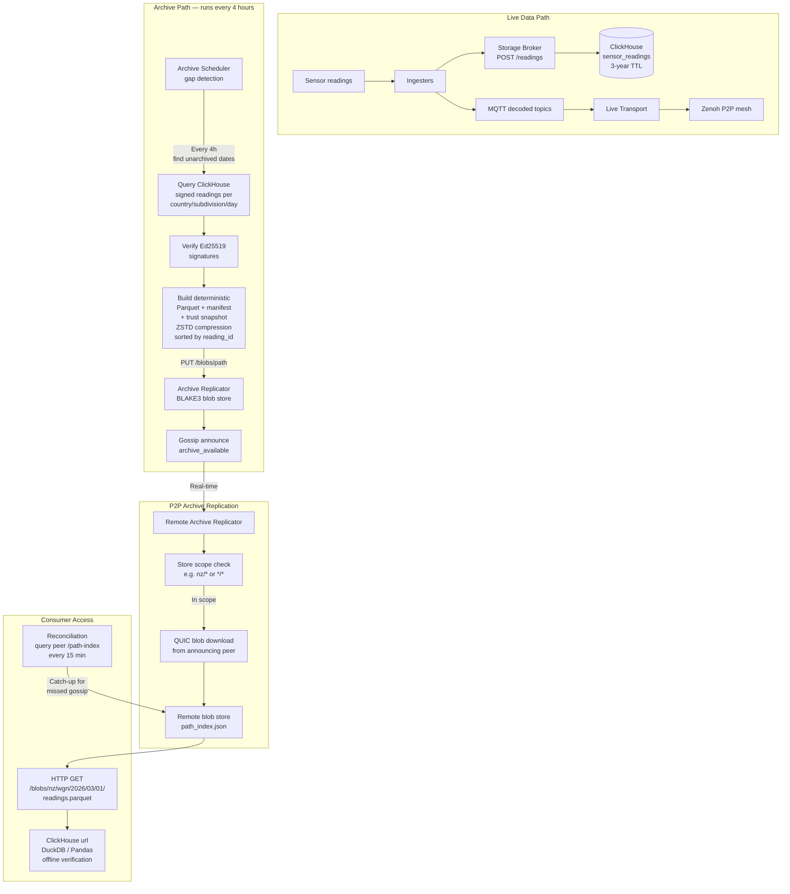

# Storage & Archives

## Analytical Purpose

WeSense is designed as a **long-term analytical storage system** - a permanent environmental dataset that enables research into patterns like:

- How rush hour traffic affects CO2 and PM2.5 levels
- Seasonal temperature and humidity variations
- Air quality correlations with weather patterns
- Long-term climate trends across regions

This analytical purpose drives key design decisions:

**Raw data ingestion (no normalization at ingestion time):**

Different sensors report at vastly different intervals:

- WeSense native sensors: every 5 minutes
- Meshtastic devices: every 20 minutes to 4 hours (variable)
- Home Assistant sensors: varies by integration
- Future sources: unknown intervals

**Data is stored exactly as received** - no normalization or averaging at ingestion time. This preserves maximum information and avoids premature data loss. Each reading includes its actual timestamp, and the varying intervals are a feature, not a problem.

Normalization and aggregation happen at **query time or archive time**:

- Queries can aggregate to any desired resolution (5-min, hourly, daily)
- Archives apply the archival strategy (see Section 5.4)
- Raw data in ClickHouse enables flexible analysis

This "store raw, aggregate later" approach enables:

- No information loss at ingestion
- Flexibility to compute any aggregation needed
- Proper handling of irregular sensor intervals
- Simpler ingestion pipeline (no buffering/averaging logic)

**Granularity matters for analysis:**

- **Daily averages** lose rush hour patterns (traffic peaks at 8am and 5pm) - insufficient for most research
- **Hourly averages** capture daily cycles but lose minute-by-minute spikes
- **Raw timestamps** capture actual sensor behaviour and enable any analysis

Given ClickHouse's excellent compression and the partitioned nature of the network (each node stores its region, not the world), raw data can be retained for extended periods. See Section 5.4 for storage calculations and the tiered archival strategy.

## Real-Time Distribution

Sensors publish readings at varying intervals. These raw readings flow through the system as-is:

1. **Stored in ClickHouse** — Raw readings with original timestamps AND Ed25519 signatures (`signature`, `ingester_id`, `key_version` columns persisted for archive integrity)
2. **Broadcast via Zenoh** — Individual readings as received, wrapped in SignedReading protobuf
3. **Archived via storage broker** — Periodic self-contained archives (Parquet with signature columns + trust snapshot + signed manifest), verified by multiple independent archivers (see Section 5.4)

Message volume remains manageable through geographic partitioning — consumers subscribe to Zenoh key expressions matching only the regions they need (e.g., `wesense/v2/live/nz/**`), not a global firehose.

## ClickHouse Compression

ClickHouse provides excellent compression for time-series sensor data:

- **Columnar storage** - Similar values compress together
- **Compression ratio** - Typically 15-30x for sensor data
- **Why so effective**:
  - Timestamps are monotonically increasing
  - Device IDs, country/subdivision codes repeat
  - Sensor values cluster around similar numbers

**Storage estimate at scale:**

```
1M devices × 10 sensors × 288 readings/day × 200 bytes = 576 GB/day uncompressed
With 20x compression = ~29 GB/day
For 1 month = ~870 GB
```

This is manageable for most deployments, allowing retention of full-resolution data for extended periods.

## Long-Term Archival Strategy (200-Year Horizon)

WeSense aims to be a **permanent environmental record** spanning centuries, not decades. This requires thinking beyond typical data retention policies.

**Design goals:**

- Preserve analytical value for research questions like:
  - "How have rush hour CO2 readings changed over the last century?"
  - "What CO2 levels did people experience in bedrooms in 2025 vs 2125?"
  - "What is the correlation between CO2 and temperature at different times of day across decades?"
- Never use daily averages (destroys time-of-day signal which is critical for most environmental analysis)
- Always preserve distribution (percentiles), not just mean
- Keep storage manageable for regional nodes

**Tiered aggregation strategy:**

> **Deferred — community decision.** Raw 5-minute data is the initial archive format. The raw data IS the unique value — existing environmental networks publish hourly or daily averages, while WeSense's 5-minute granularity enables analysis that's never been possible at this scale. Summarisation can be layered on later once the raw archive infrastructure is solid and usage patterns reveal what summaries are actually needed. See Phase2Plan.md Section 14.2.2.

| Data Age     | Resolution            | Points/Day | Storage Ratio | Rationale                     |
| ------------ | --------------------- | ---------- | ------------- | ----------------------------- |
| 0-10 years   | Raw 5-min             | 288        | 1x            | Full analytical flexibility   |
| 10-50 years  | Hourly (rich stats)   | 24         | ~12x smaller  | Captures time-of-day patterns |
| 50-200 years | 6-hourly (rich stats) | 4          | ~72x smaller  | Captures diurnal cycle        |

**"Rich statistics" format:**

Aggregated records preserve the distribution, not just the mean:

```json
{
  "period_start": "2075-06-15T06:00:00Z",
  "period_hours": 6,
  "device_id": "...",
  "reading_type": "co2",
  "count": 72,
  "mean": 450.5,
  "min": 420,
  "max": 510,
  "stddev": 25.3,
  "p5": 422,
  "p25": 435,
  "p50": 448,
  "p75": 465,
  "p95": 502
}
```

This preserves:

- Time-of-day patterns (6-hourly = morning/afternoon/evening/night)
- Distribution shape (percentiles show spread, not just central tendency)
- Outlier information (p5, p95 capture extremes)
- Variability (stddev, min/max range)

**Storage calculations (per region, NZ-scale ~10,000 sensor streams):**

```
0-10 years:   10 GB/year × 10 years   = 100 GB (raw 5-min)
10-50 years:  0.8 GB/year × 40 years  = 32 GB (hourly, ~12x smaller)
50-200 years: 0.14 GB/year × 150 years = 21 GB (6-hourly, ~6x smaller)

Total per region for 200 years: ~153 GB
```

This is remarkably small - a single modern SSD can hold 200 years of regional environmental data.

**Global scale (archival/research nodes):**

```
0-10 years:   10 TB/year × 10 years   = 100 TB
10-50 years:  0.8 TB/year × 40 years  = 32 TB
50-200 years: 0.14 TB/year × 150 years = 21 TB

Total global for 200 years: ~153 TB
```

Significant but achievable for research institutions. Most participants only need their region.

**Format longevity considerations:**

200 years exceeds any digital format's proven lifespan. Mitigation strategies:

1. **Self-describing formats** - Parquet embeds schema in the file
2. **Simple fallback** - CSV exports alongside Parquet for ultimate compatibility
3. **Documentation in-band** - README files stored with archives describing format
4. **Active curation** - Plan for format migration every 20-30 years as technology evolves
5. **Community-driven replication** - distributed stewardship replaces centralised infrastructure (see Phase2Plan.md Section 14.2.1)

**Community-driven replication model:**

The archive is a distributed responsibility, not a centralised one. Anyone running a WeSense node can choose what to archive and pin. A home labber in Wellington pins Wellington's data. Someone in Auckland pins Auckland. A university pins the whole country. The structure makes every level independently pinnable.

| Persona     | Default pin scope                           | Rationale                                                           |
| ----------- | ------------------------------------------- | ------------------------------------------------------------------- |
| Contributor | None — contributes data, not storage        | Lowest barrier to entry. Every sensor matters.                      |
| Station     | Own subdivision (if pinning enabled)        | Has the disk space and uptime. Natural step up from contributor.    |
| Guardian    | Own country (or region for large countries) | The archiving workhorse. Expected to provide resilience for others. |
| Observer    | Own subdivision (if pinning enabled)        | Has storage, receives data. Could pin what it already sees.         |
| Researcher  | Whatever they download                      | Pull-based. May hold large datasets for analysis.                   |

Even a small country like NZ should have multiple independent copies. The more people who pin a partition, the more resilient it becomes. Nodes go offline — people move house, hardware fails. As long as at least one node anywhere holds a copy, the data survives. New nodes pull the complete history for their pinned scope from whoever currently holds it. See Phase2Plan.md Section 14.2.1 for the full self-healing replication model.

**Archive structure:**

Each archive is a self-contained, independently verifiable directory:

```
/{country}/{subdivision}/{year}/{month}/{day}/
  readings.parquet              ← Signed readings (includes signature, ingester_id, key_version columns)
  trust_snapshot.json           ← Public keys for all ingester_ids in this batch
  manifest.json                 ← Content hash, archiver signature, metadata
```

Archives are partitioned by country, subdivision, and date in a browsable directory tree:

```
/                                ← root, served by storage broker
  nz/
    auk/
      2026/
        02/
          01/
            readings.parquet
            trust_snapshot.json
            manifest.json
          02/
            readings.parquet
            ...
    wgn/
      2026/
        02/
          01/
            readings.parquet
            ...
  au/
    nsw/
      2026/
        02/
          01/
            readings.parquet
            ...
```

Consumers browse the archive tree via the storage broker's HTTP endpoint by country/subdivision/year/month/day and fetch only the directories they need. A New Zealand researcher never needs to download Australian data. Once fetched, Parquet files can be imported into local ClickHouse (via `url()`) or queried directly with DuckDB/pandas.

The archive tree is maintained by the storage broker and served over HTTP. Each station's storage broker maintains its own archive root, backed by the archive replicator for content-addressed storage. Consumers always access archives via `GET /data/{path}`.

**Offline verification:** A researcher downloading an archive can verify every reading using only the bundled `trust_snapshot.json` — no network access or live infrastructure needed. For stronger guarantees, check `wesense.attestations` in OrbitDB to see how many independent archivers verified the same data (same `readings_hash` = consensus).

## Deduplication

Readings include a unique `reading_id` (hash of device_id + timestamp + reading_type) for deduplication. ClickHouse's ReplacingMergeTree engine handles duplicates during background merges.

## Distribution Layer

**Status:** Implemented. Iroh selected as the archive distribution backend.

The distribution layer handles how archive partitions are replicated across the network and how ClickHouse instances retrieve historical data. After evaluating IPFS (Kubo) and Iroh, **Iroh was selected** as the archive backend for its better architectural fit with WeSense's closed-community replication model.

**Why Iroh over IPFS:**

| Criterion                       | IPFS (Kubo)                         | Iroh (selected)                                               |
| ------------------------------- | ----------------------------------- | ------------------------------------------------------------- |
| **Content addressing**          | SHA-256 CIDs                        | BLAKE3 (faster, SIMD-accelerated)                             |
| **Efficient bulk download**     | Single gateway (not true P2P)       | True P2P with verified streaming + resume at 1KiB granularity |
| **Works behind NAT**            | Unreliable (AutoNAT/relay v2)       | Excellent (Tailscale-derived hole punching + DERP relay)      |
| **Scales without centralising** | Gateways tend toward centralisation | Gossip + direct transfer, no gateway bottleneck               |
| **Resource usage**              | Heavy (Kubo DHT maintenance)        | Light (200K concurrent connections demonstrated)              |
| **Blob model**                  | UnixFS chunking overhead            | Flat blob model ideal for opaque Parquet files                |

The `wesense-archive-replicator` (Rust, port 4400) provides BLAKE3 content-addressed blob storage with iroh-gossip for P2P archive announcements. The storage broker communicates with it via HTTP API. Archives written to the archive replicator are automatically available for P2P replication to other stations running the same service.

### Archive Replicator Connectivity Model

Archive replicators form a **closed P2P network** — they do not connect to iroh's public relay infrastructure or any external discovery service. This is a deliberate architectural choice for a system designed to scale to 100 million+ nodes without depending on third-party infrastructure.

**Peer discovery:** Each archive replicator registers its iroh NodeId, QUIC address, and port in OrbitDB (`wesense.nodes`). Periodically (every 60s), archive replicators query OrbitDB for other registered replicators and wire discovered peers into the iroh endpoint's address lookup and gossip mesh. This is fully automatic — no manual bootstrap peers required.

**Direct QUIC connections:** Archive replicators connect directly to each other via QUIC on port 4401 (UDP). Operators must:

1. Set `ANNOUNCE_ADDRESS` to their host's reachable IP or hostname (public IP, VPN IP, etc.)
2. Port-forward UDP 4401 on their router/firewall

This is the same model as running any P2P service — the operator ensures their node is reachable. The archive replicator logs a clear warning at startup if `ANNOUNCE_ADDRESS` is not set.

**No public relays:** The archive replicator uses `RelayMode::Disabled` and `clear_address_lookup()` by default. It does not connect to iroh's public DERP relays or DNS-based discovery. At 100M nodes, public relays would be overwhelmed and introduce a centralisation point.

**NAT traversal:** Most home/office NATs support port forwarding, which is sufficient. For the minority of users behind CGNAT (carrier-grade NAT) where port forwarding is impossible, WeSense will deploy its own DERP relay servers in the future:

| NAT Type           | Solution                       | Status             |
| ------------------ | ------------------------------ | ------------------ |
| Standard NAT       | Port-forward UDP 4401          | Working now        |
| CGNAT / Double-NAT | WeSense DERP relay servers     | Future (see below) |
| VPN / Tailscale    | Set ANNOUNCE_ADDRESS to VPN IP | Working now        |

**Future: WeSense relay servers.** When needed for CGNAT users, WeSense community members will deploy DERP relay servers (using iroh's `iroh-relay` binary). These relays will be:

- Operated by community members on the `hub` persona (just like Zenoh routers)
- Registered in OrbitDB (`wesense.nodes` with `iroh_relay_urls` field) so all archive replicators discover them automatically
- Configured on relay-operating nodes via `IROH_RELAY_URLS` env var
- Propagated to other archive replicators during OrbitDB peer discovery — configure once, all peers learn

The relay infrastructure is opt-in and community-operated. No single entity controls relays. If a relay goes down, peers fall back to direct connections or other relays. The archive replicator code already supports `IROH_RELAY_URLS` and relay discovery from peers — only the relay servers themselves need to be deployed.

**Store scope:** Each archive replicator is configured with `IROH_STORE_SCOPE` (default `*/*` — replicate everything). This controls which regions' archives are downloaded and stored locally. Everything stored is automatically served to any peer that requests it. Operators can narrow scope to save disk space (e.g. `nz/*` for only New Zealand).

### Archive Replication Protocol

Archive replication uses two mechanisms that work together over the existing iroh QUIC connections — no HTTP ports, no additional infrastructure, no centralised coordination.

**Mechanism 1: Real-time gossip announcements (normal operation)**

When the storage broker archives a new batch of readings:

1. Storage broker builds a deterministic Parquet file for a country/subdivision/day

2. Storage broker PUTs the blob to the local archive replicator via HTTP (internal Docker network only)

3. Archive replicator stores the blob with BLAKE3 content-addressing

4. Archive replicator broadcasts a gossip announcement on the `wesense-archives` topic:
   
   ```
   { msg_type: "archive_available",
     country: "nz", subdivision: "wgn", date: "2026-03-31",
     hash: "<BLAKE3 hex>", path: "nz/wgn/2026/03/31/readings.parquet",
     size: 245000, node_id: "<announcing node>" }
   ```

5. All connected peers receive the announcement via iroh-gossip (QUIC)

6. Each peer checks:
   
   - Does the path match my store scope? (e.g. `IROH_STORE_SCOPE=nz/*`)
   - Do I already have this blob in my path-index?

7. If in scope and missing: download the blob from the announcing peer via iroh-blobs Downloader (QUIC, verified streaming, resumable)

8. Update local path-index

This handles the steady-state case — all online peers get new archives within seconds of creation. The gossip message is ~200 bytes. The actual blob transfer uses iroh's efficient QUIC streaming protocol.

**Mechanism 2: Peer catch-up on connect (index-based bulk sync)**

iroh-gossip is fire-and-forget — if a node is offline when an announcement is broadcast, it never receives it. New nodes joining the network have never received any announcements. This is the catch-up problem.

> **IMPORTANT: Do NOT re-announce individual archives over gossip for catch-up.**
> 
> The original design tried broadcasting one gossip message per archive on `NeighborUp`. With 80K+ archives, this floods the gossip receiver buffer (`Event::Lagged`), overwhelms the fetch channel, and drops most messages. Gossip is for single real-time announcements, not bulk sync. See implementation notes below.

**The correct approach: index-as-a-blob**

The path-index (`path_index.json`) is itself a blob — a JSON file mapping logical paths to BLAKE3 hashes. Instead of announcing 80K individual items, exchange the index as a single blob and diff locally.

Flow:

1. New node joins the gossip topic (discovered via OrbitDB, connected via QUIC)
2. On `NeighborUp`, the new node sends a single gossip message: `{ type: "catchup_request", node_id: "..." }`
3. The existing peer receives the request and writes its `path_index.json` to the blob store as a temporary blob (or it's already there)
4. The existing peer responds with a single gossip message: `{ type: "catchup_index", node_id: "...", hash: "<BLAKE3 of path_index.json>", size: 5000000 }`
5. The new node downloads the index blob via iroh-blobs Downloader (single QUIC transfer, ~5MB for 80K entries, verified streaming, resumable)
6. The new node parses the peer's index, diffs against its own local index
7. For each missing archive (matching store scope): download the blob via Downloader from the peer

This uses iroh the way it was designed:

- **One metadata transfer** (the index blob) instead of 80K gossip messages
- **iroh Downloader handles throughput, backpressure, multiplexing natively** — no application-level rate limiting or channel management
- **The diff is local** — no network traffic for archives already held
- **Downloads are parallel** — the Downloader can fetch multiple blobs concurrently

**Status:** Implemented (2026-04-01). Index-as-a-blob exchange with `send().await` backpressure. Catch-up runs on `NeighborUp` AND every 15 minutes periodically. Single-threaded replicator currently processes ~12,800 archives/hour (~307K/day).

> **RESOLVED (2026-04-12): Iroh blob store garbage collection**
> 
> The index-as-a-blob catch-up mechanism was creating a new ~12 MB blob (the serialised path index) on every sync exchange. With `named_tag`, the tag reassigns to the new blob each time, but without garbage collection enabled on the FsStore, old untagged blobs accumulated indefinitely. Over months of operation, this resulted in ~26,000 orphaned index copies consuming 41+ GB per node — while actual archive data was only ~1 GB.
> 
> **Fix:** Enabled iroh's built-in garbage collection via `FsStore::load_with_opts` with `GcConfig { interval: 600s }`. GC runs every 10 minutes, identifies blobs not referenced by any tag (mark phase), and deletes them in batches (sweep phase). After deployment, storage dropped from 43 GB to 324 MB — a 99% reduction.
> 
> **Storage profile (with GC, 98K archives, scope `*/*`):**
> 
> - Actual Parquet archive data: ~1 GB (ZSTD-compressed internally)
> - Iroh metadata + active sync blobs: ~300 MB
> - ClickHouse sensor readings: ~370 MB (columnar compression)
> - ClickHouse system logs (with 3-day TTL): ~20 MB
> 
> The iroh FsStore uses a SQLite database (`blobs.db`) internally for blob metadata indexing. This is an implementation detail — operators don't interact with it directly.

**Why this scales to 10M+ nodes:**

Real-time announcements (mechanism 1):

- iroh-gossip uses epidemic broadcast with ~6-8 direct peers per node. One announcement reaches 10M nodes in ~23 hops (log₈ of 10M). Each node only processes messages from its direct peers, not all 10M.
- At 10M nodes producing 10 archives/day each = 100M announcements/day globally = ~1,200/second. Each node receives these filtered by its gossip mesh peers, not all 1,200/sec. With store scope filtering, a node storing `nz/*` only processes NZ-related announcements.
- Gossip messages are ~200 bytes. Even at 1,200/sec that's 240KB/sec — trivial bandwidth.

Catch-up (mechanism 2 — index-based):

- New node downloads one 5MB index blob per peer, not 80K individual messages
- Diff is local computation — O(N) where N is the peer's index size, no network traffic
- Missing blob downloads use iroh's native concurrent downloader — QUIC multiplexing handles throughput
- A node with `nz/*` scope only downloads NZ archives from the diff — ~1% of a global peer's index
- Multiple peers can serve the same blob — the Downloader automatically finds the fastest source

At 10M nodes with 1M archives each:

- Index blob: ~60MB per peer (1M entries × ~60 bytes each). Downloaded once per peer connect. Compressible.
- Diff produces a list of missing blobs. Download only what's needed.
- iroh handles the rest — verified streaming, resume on disconnect, parallel transfers.

**Failure modes and recovery:**

| Scenario                           | What happens                             | Recovery                                                                              |
| ---------------------------------- | ---------------------------------------- | ------------------------------------------------------------------------------------- |
| Node offline during announcement   | Misses the gossip message                | Catches up via index exchange on reconnect                                            |
| Node joins network for first time  | Has no archives                          | Downloads peer index, diffs to empty local index, downloads everything matching scope |
| Peer disconnects mid-download      | Downloader transfer interrupted          | iroh resumes at 1KiB granularity on reconnect                                         |
| Gossip message lost (network blip) | Node doesn't know about one archive      | Catches up on next peer reconnect via index diff                                      |
| Two archivers create same archive  | Same BLAKE3 hash (deterministic Parquet) | Second copy is a no-op — already in local store                                       |

**Future: Increasing catch-up throughput**

The current replicator downloads one blob at a time (~20ms each = ~50 blobs/sec). At scale:

| Archives to sync | Current (sequential) | With 10 parallel | With 50 parallel |
| ---------------- | -------------------- | ---------------- | ---------------- |
| 10,000           | 3 minutes            | 20 seconds       | 4 seconds        |
| 100,000          | 33 minutes           | 3 minutes        | 40 seconds       |
| 1,000,000        | 5.5 hours            | 33 minutes       | 7 minutes        |
| 10,000,000       | 2.3 days             | 5.5 hours        | 1.1 hours        |

Improvements in priority order:

1. **Parallel blob downloads** — The iroh Downloader supports concurrent transfers natively. Spawn N download workers reading from the same channel. Each worker downloads independently via QUIC multiplexing (multiple streams on one connection). The `send().await` backpressure still works — it just feeds N workers instead of 1. Expected: 10-50x throughput increase with minimal code change.

2. **Multi-peer downloads** — When multiple peers hold the same blob (common for popular regions), the Downloader can fetch from the closest/fastest peer. The `source_node` in FetchRequest currently names one peer. Extending to multiple providers lets iroh's built-in provider selection optimise throughput.

3. **Compressed index transfer** — At 10M+ entries, the path-index blob grows to ~60-100MB. Compressing with zstd before import (and decompressing on receive) reduces transfer to ~10-20MB. The diff computation stays the same.

4. **Incremental index diff** — Instead of exchanging the full index every cycle, exchange only changes since the last sync. Track a "last sync timestamp" per peer. The catch-up request includes the timestamp, and the peer only exports entries newer than that. Reduces index blob size from O(total archives) to O(new archives since last sync).

5. **Scope-filtered index export** — When responding to a catch-up request, filter the index to only include entries matching the requester's store scope. A node storing `nz/*` doesn't need to download a 100MB global index — just the NZ subset. Requires the requester to include its scope in the `catchup_request` message.

6. **Range-based blob batching** — Instead of downloading each archive file individually (readings.parquet, manifest.json, trust_snapshot.json = 3 downloads per archive day), batch all files for a date range into a single transfer. iroh supports collections (groups of blobs transferred as one unit).

None of these require architectural changes — the index-as-a-blob + backpressure design supports all of them as incremental improvements.

**What this replaces:**

1. OrbitDB attestations (removed — grew unbounded, caused sync timeouts and OOM)
2. HTTP reconciliation (removed — required exposed port, polled every 15 minutes)
3. Gossip re-announce flood (removed — overwhelmed gossip buffer at scale)

## Storage Broker Architecture

**Status:** Implemented (`wesense-storage-broker` + `wesense-archive-replicator`).

The storage broker (`wesense-storage-broker`, Python/FastAPI, port 8080) sits between ingesters and the archive backend, providing a uniform HTTP API for reading ingestion and archive access. The archive replicator (`wesense-archive-replicator`, Rust, port 4400) handles content-addressed blob storage.

```
                         ┌─────────────────────────────┐
Ingester A ─┐            │     Storage Broker API        │
Ingester B ─┤──readings─→│                               │──→ ClickHouse (live queries)
Ingester C ─┘            │  POST /readings               │──→ Parquet construction
  ...N more...           │  GET  /archive/{path}         │──→ Archive Replicator (port 4400)
                         │  GET  /archive/tree           │
Respiro map ─────query──→│  GET  /data/{path}            │──→ HTTP serving for ClickHouse url()
ClickHouse  ─────query──→│  GET  /status                 │
                         └─────────────────────────────┘
```

**What the storage broker handles:**

| Responsibility                  | Previously                                 | With storage broker                                                          |
| ------------------------------- | ------------------------------------------ | ---------------------------------------------------------------------------- |
| Receive readings from ingesters | Each ingester → direct ClickHouse writes   | Ingesters → `POST /readings` → storage broker writes to ClickHouse           |
| Construct Parquet files         | Archiver reads ClickHouse, builds Parquet  | Storage broker builds Parquet from its write stream (or reads ClickHouse)    |
| Store archives                  | Archiver → Kubo MFS API (15+ direct calls) | Storage broker → archive replicator (BLAKE3 blobs)                           |
| Serve archives for ClickHouse   | Kubo HTTP gateway on :8080                 | Storage broker serves `GET /data/{country}/{subdiv}/{date}/readings.parquet` |
| Announce availability           | Not implemented                            | Archive replicator gossip + OrbitDB attestation                              |
| Track what's archived           | Archiver queries Kubo MFS ls               | Storage broker maintains its own index                                       |

**Impact on ingesters:** They become ultra-thin protocol decoders. A new hardware ingester just needs to decode the device's native protocol and send standardised readings to `POST /readings` on the storage broker. No ClickHouse dependency, no Parquet knowledge, no archive awareness.

**Impact on the archiver:** The archiver logic (schedule, gap detection, Parquet construction, verification) is built into the storage broker as a scheduled task.

## Archive Data Cycle (Reference)

This diagram shows the complete lifecycle of sensor data from live ingestion through to distributed archival and how a remote station retrieves historical data.



**Current status (2026-03-31):**

| Component                    | Status                           | Notes                                                               |
| ---------------------------- | -------------------------------- | ------------------------------------------------------------------- |
| Live ingestion to ClickHouse | Working                          | All ingesters via storage broker                                    |
| Archive scheduler (4h cycle) | Working                          | Gap detection, deterministic Parquet, ZSTD                          |
| Signature verification       | Working                          | Ed25519, trust snapshot bundled                                     |
| Iroh blob storage            | Working                          | BLAKE3 content-addressing, path index                               |
| Gossip announcements         | Working                          | Real-time archive_available broadcasts                              |
| P2P blob replication         | Not tested since OrbitDB changes | Reconciliation rewritten to use peer path-index, needs verification |
| ClickHouse url() integration | Not built                        | Would allow querying archived Parquet directly from ClickHouse      |
| Summarisation                | Not built                        | Raw data only. Planned as community decision on rollup granularity  |
| Parquet optimisation         | Not built                        | Binary signatures, dictionary encoding, sidecar separation planned  |

**Deduplication across the archive pipeline:**

Dedup happens at three levels:

1. **ClickHouse** — `ReplacingMergeTree(timestamp)` with `FINAL` in archive queries. Same reading from multiple ingesters (via P2P) produces the same `reading_id` (SHA-256 of device_id + timestamp + reading_type + value). Only one row survives.

2. **Parquet determinism** — archive sorted by `reading_id`, ZSTD compressed, no dictionary encoding. Same input data always produces the same Parquet bytes. Two archivers independently processing the same day/region produce byte-identical files.

3. **BLAKE3 content-addressing** — identical Parquet files produce the same BLAKE3 hash. Iroh stores one blob per hash. If a second archiver uploads the same content, it's the same blob. During replication, the path-index check (`exists in local index?`) skips already-held archives.

**Scale considerations:**

At 1M devices x 10 readings x 12 per hour x 24 hours = ~2.88 billion readings/day globally. Partitioned by country/subdivision/day, a busy region like Auckland might have 500K readings/day, producing a ~50MB Parquet file (with ZSTD). With 200 countries and ~5000 subdivisions, global daily archives total ~50-100GB. The 3-year ClickHouse TTL means live data is eventually pruned, but the iroh archive is permanent. Summarisation (hourly/daily rollups) would reduce archive size by 10-50x but loses raw granularity — deferred as a community decision.

## Parquet Format Optimisation

**Status:** Planned. See Phase2Plan.md Section 14.5 for the full details.

These optimizations are implemented within the storage broker's Parquet construction logic. They are transport-agnostic — they improve archive size and query performance regardless of backend.

| Phase   | Change                                                                      | Cumulative Reduction          |
| ------- | --------------------------------------------------------------------------- | ----------------------------- |
| Phase A | Binary signatures (`pa.binary(64)`) + ZSTD tuning                           | ~50%                          |
| Phase B | Dictionary encoding + statistics enabled                                    | ~60-65%                       |
| Phase C | Sidecar separation (readings.parquet + signatures.parquet) + column pruning | ~65-70%                       |
| Phase D | Bundle export (CAR file / tarball for HTTP mirroring)                       | 0% (distribution improvement) |

**Phase A** (highest impact, lowest effort): Ed25519 signatures stored as 64 raw bytes instead of 128-char hex strings. ZSTD compression level benchmarked against real data — level 9 is the expected sweet spot (decompression speed is roughly constant across levels).

**Phase B** (re-enable disabled features): Parquet dictionary encoding and row-group statistics were disabled due to unfounded determinism concerns. A determinism test (generate from fixed data, write twice, assert byte-identical) must pass before deploying. Statistics enable ClickHouse to skip irrelevant row groups when querying remote Parquet via the storage broker.

**Phase C** (sidecar separation): Split archive into `readings.parquet` (sensor data for research queries) and `signatures.parquet` (verification data). Researchers and ClickHouse queries hit readings without loading 64 bytes/row of signatures. Columns like `geo_country` (constant per archive, encoded in directory path) and `reading_id` (computable from signed fields) are removed.

**Phase D** (distribution): Portable bundle per day per subdivision for HTTP mirroring. Universities and researchers can host archives via plain HTTP without running a P2P node.
