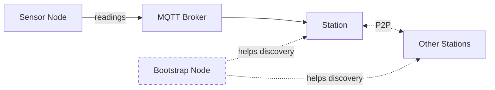

# Quick Start

There are several ways to contribute sensor data to WeSense. The right path depends on what you already have.

## How the pieces fit together

Before the decision tree, a quick orientation. WeSense has a handful of moving parts — knowing what each one does will make the rest of these docs much easier to navigate.



- **Sensor Node** — the device that actually reads the environment. Could be a WeSense-flashed ESP32 board, a Meshtastic device with sensors attached, or an existing system you already own (Ecowitt weather station, Home Assistant, etc.).
- **MQTT Broker** — where sensor nodes send their readings. By default this is `mqtt.wesense.earth`, run by the WeSense project. You can also run your own if you want a local entry point.
- **Station** — a computer somewhere that receives readings, decodes and geocodes them, stores them in a database, shows them on a map, and optionally archives and replicates them across the P2P network. Stations come in a few shapes depending on how much you want to run — see the table below.
- **Bootstrap Node** — a side role, not required. It's a publicly-reachable peer that helps new stations find existing ones faster when they first come online. Stations can discover each other without a bootstrap (via mDNS on a LAN, or the P2P network's own discovery), but a well-known bootstrap speeds things up — especially across the internet.

The terminology can be fuzzy because a single physical computer often plays more than one role. One Raspberry Pi at your house might be a "station" *and* an "MQTT broker" *and* a "bootstrap node" all at once. The separation is about **responsibilities**, not about separate hardware.

## I already have sensors

If you already have environmental sensors (Ecowitt weather stations, Home Assistant devices, or anything that publishes MQTT), you can start contributing data immediately.

**Point your sensors at the WeSense MQTT broker:**

```
Host: mqtt.wesense.earth
Port: 8883 (MQTTS)
```

Your data will be ingested, geocoded, and appear on the [live map](https://map.wesense.earth). See the [MQTT topic structure](/developers/data-schema#mqtt-topic-structure) for payload format.

**Home Assistant** and **Ecowitt** integrations are coming soon — see [Ingester Status](/developers/ingesters) for current progress.

## I want to build a sensor

### WiFi (simplest)

Build a WeSense node using an ESP32 board and environmental sensors. It connects to your WiFi and reports readings every 5 minutes directly to `mqtt.wesense.earth`.

1. Choose your hardware — see [Recommended Sensors](/getting-started/recommended-sensors)
2. Wire and flash — see [Build a WeSense Node](/getting-started/build-wesense-node)
3. Configure WiFi and MQTT, power it on — data flows automatically

**Cost:** From ~$15 (basic temp/humidity) to ~$120 (full environmental suite)

### LoRaWAN (no WiFi needed)

If your sensor location doesn't have WiFi, you can transmit over LoRaWAN via The Things Network (TTN). This requires a public TTN gateway to be available in your region — check coverage on the [TTN Mapper](https://ttnmapper.org) or the [official TTN map](https://www.thethingsnetwork.org/map).

The simplest option is to use the default WeSense TTN credentials built into the firmware — just flash, and your sensor connects to the WeSense TTN application automatically. If you prefer to run your own TTN application, you can register a free account on [The Things Network](https://www.thethingsnetwork.org/) and configure the firmware with your own credentials.

1. Build a WeSense node with a LoRa-capable board (e.g. T-Beam)
2. Flash the firmware with LoRaWAN enabled (default WeSense credentials are built in)
3. Data is relayed via TTN webhook to the WeSense ingester

::: info TTN Free Account Limits
The Things Stack Sandbox (free) allows 30 seconds of uplink airtime per day per node, and 10 downlink messages per day. WeSense reports every 5 minutes (288 uplinks/day) with small protobuf payloads — this fits within the free tier at typical spreading factors, though nodes at the edge of gateway range (high spreading factors) may need to report less frequently.
:::

### Meshtastic (mesh network)

Add environmental sensors to a Meshtastic device. Your readings travel across the mesh network and into WeSense automatically — no internet connection needed at your sensor location, as long as there's a gateway node local to your mesh neighbourhood.

- [Meshtastic Node](/getting-started/meshtastic-node) — Add sensors to a Meshtastic device
- [Meshtastic Gateway](/getting-started/meshtastic-gateway) — Bridge your local mesh to the internet

## I want to run a station

Stations are the backbone of the WeSense network. There are several types depending on how much you want to run:

| Station Type | What It Runs | What It Does |
|-------------|-------------|-------------|
| **Contributor** | Ingesters only | Collects data from your sensors and forwards it to a remote hub |
| **Guardian** | Full stack (MQTT, ClickHouse, Ingesters, Map, P2P) | Stores, serves, and replicates data for your region — the most valuable station type |
| **Hub** | MQTT broker only | Acts as a public MQTT entry point for sensors in your area |

A **Guardian** station is the most impactful — it stores sensor data in ClickHouse, archives it in Parquet format, and replicates archives across the P2P network so no single point of failure can lose the data. The more guardians, the more resilient the network.

As a guardian, you choose your **storage scope** — how much of the network's data you store and serve:

| Scope | What You Store | Disk Usage |
|-------|---------------|------------|
| Your subdivision (e.g. `nz/wgn`) | Just your local area | Minimal |
| Your country (e.g. `nz/*`) | All data for your country | Moderate |
| A region (e.g. `nz/*,au/*`) | Multiple countries | Larger |
| Everything (`*/*`) | The entire network | World node — largest |

The network needs nodes at every level to ensure data is backed up and available. Even storing just your local area helps.

All station types run as Docker Compose profiles on a Raspberry Pi, home server, or NAS. See [Operate a Station](/station-operators/operate-a-station) for the setup guide, or [Deployment Profiles](/station-operators/deployment-profiles) for details on each type.

## I want to contribute code

See the [Developer docs](/developers/architecture) for architecture overview, or jump straight to [Writing an Ingester](/developers/writing-an-ingester) if you want to connect a new data source.

## What happens to my data?

All sensor data contributed to WeSense is:

- **Free and open** — anyone can access it, forever
- **Stored in ClickHouse** — queryable time-series database
- **Archived in Parquet** — open format readable by ClickHouse, Pandas, DuckDB, Apache Spark, and most data science tools
- **Replicated via P2P** — distributed across stations so no single point of failure
- **Visible on the [live map](https://map.wesense.earth)** — within seconds of arriving

### A note on privacy

The only potentially private information in sensor data is the location. WeSense gives you full control over how precise your location is:

- **Add a margin of error** — offset your coordinates so your data represents your neighbourhood without revealing your exact address
- **Choose a fixed location** — set any location you like rather than using GPS
- **Omit location entirely** — your data will still be stored but won't appear on the map

How much location detail you share is entirely up to you. Environmental data itself (temperature, humidity, CO2, etc.) is not personally identifiable.
